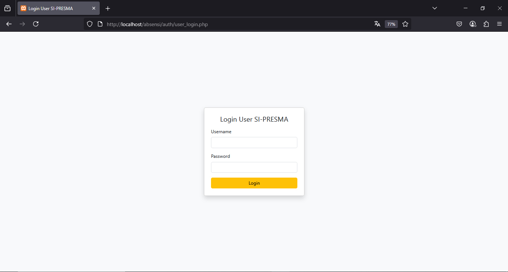

# SI-PRESMA

#### SI-PRESMA (Sistem Presensi SMA)
SI-PRESMA adalah aplikasi absensi online berbasis web yang 
memudahkan pencatatan kehadiran seluruh civitas SMA/SMK (siswa, guru, staf) 
secara real time. Dirancang dengan PHP dan MySQL, sistem ini cocok untuk 
kebutuhan demo, tugas akhir, atau implementasi di lingkungan sekolah yang 
ingin beralih ke digital.

## Preview
#### Tampilan halaman login untuk admin 

#### Tampilan halaman dashboard untuk admin

#### Tampilan halaman data presensi sekolah untuk admin
 
 

#### Tampilan halaman download excel/pdf/print untuk admin

#### Tampilan halaman login untuk user

#### Tampilan halaman utama web absensi untuk user

## Fitur Utama
1. Presensi Online: Siswa, guru, dan staf bisa mengisi presensi secara daring.
2. Dashboard Admin: Lihat rekap presensi setiap sekolah, notifikasi kehadiran terbaru, dan ekspor data.
3. Multiple School Table: Setiap sekolah punya tabel presensi sendiri (SMA 1 s/d SMA 5 + sekolah lain).
4. Ekspor Data: Download presensi ke Excel/PDF.
5. Validasi & Keamanan: OTP verifikasi email saat registrasi, password terenkripsi.
6. Akses Lokal: Bisa demo lokal.

## Cara Instalasi
1. `git clone https://github.com/Dias-Prameswari/WEB-KOM-AWAN.git`
2. Import `db.sql` ke phpMyAdmin
3. Atur koneksi di file config.php sesuai host, username, dan password.
4. Jalankan di XAMPP/Laragon, akses `http://localhost/absensi/`
5. Login Admin: username: admin, password: [isi_password_admin]
6. Login User: Registrasi terlebih dahulu dan aktivasi via OTP email.

## 📝 Teknologi yang Digunakan
1. Backend: PHP 8+
2. Frontend: Bootstrap 5, Custom CSS
3. Database: MySQL
4. Email: PHPMailer (SMTP Gmail)

---
Dibuat oleh [Dias Prameswari](https://github.com/Dias-Prameswari) | 2025
