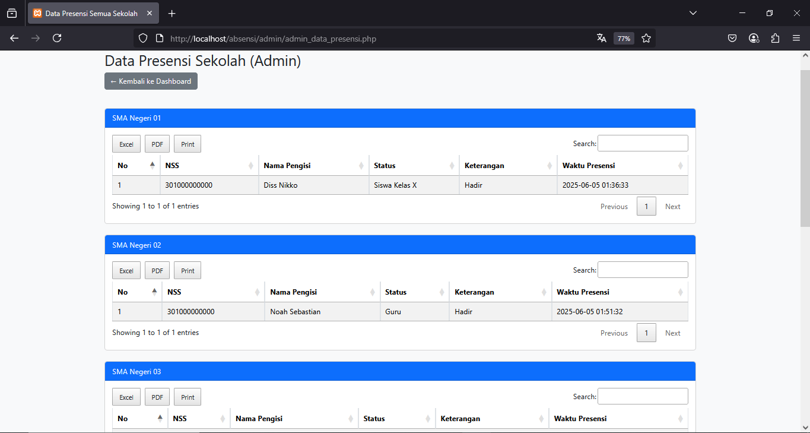
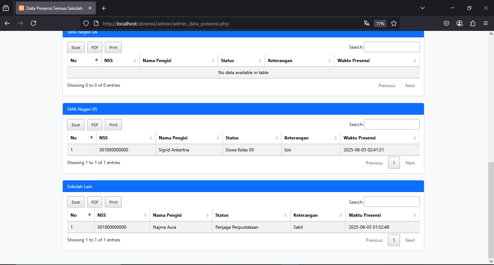

# SI-PRESMA
#### SI-PRESMA (Sistem Presensi SMA)
SI-PRESMA adalah aplikasi absensi online berbasis web yang 
memudahkan pencatatan kehadiran seluruh civitas SMA/SMK (siswa, guru, staf) 
secara real time. Dirancang dengan PHP dan MySQL, sistem ini cocok untuk 
kebutuhan demo, tugas akhir, atau implementasi di lingkungan sekolah yang 
ingin beralih ke digital.

## Preview
#### Tampilan halaman login untuk admin 

#### Tampilan halaman dashboard untuk admin

#### Tampilan halaman data presensi sekola untuk admin
 &  & 

## Fitur
- Presensi online (Siswa, Guru, Staf)
- Export Excel/PDF
- Multi sekolah, UI modern

## Cara Instalasi
1. `git clone https://github.com/yourusername/si-presma.git`
2. Import `db.sql` ke phpMyAdmin
3. Edit `config.php` untuk koneksi database
4. Jalankan di XAMPP/Laragon, akses `http://localhost/si-presma/`

## Developer
Gilfansy | [LinkedIn](https://linkedin.com/in/yourusername)
